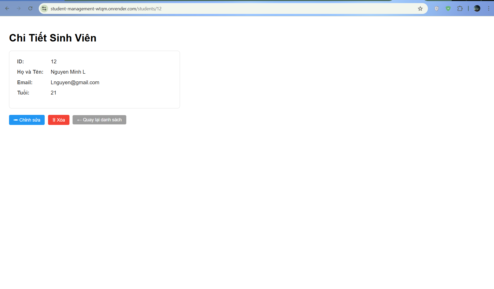
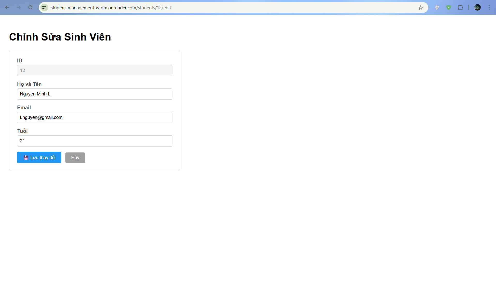
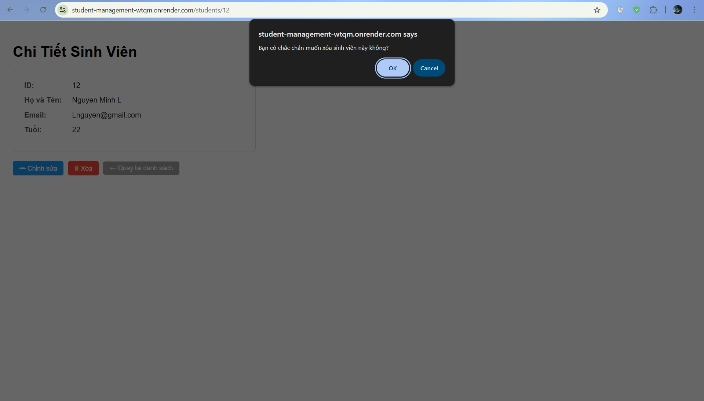

# Student Management System

Hệ thống quản lý sinh viên được xây dựng với **Spring Boot**, **Thymeleaf**, kết nối **PostgreSQL** trên [Neon.tech](https://neon.tech) và deploy lên [Render](https://render.com) bằng Docker.

🌐 **Live demo:** [https://student-management-wtqm.onrender.com](https://student-management-wtqm.onrender.com)

> **Lưu ý:** Hệ thống sử dụng Render Free tier, app có thể mất ~50 giây để khởi động nếu không có request trong thời gian dài.

## Danh sách thành viên:

|        Họ và Tên        |  MSSV  |
|-------------------------|--------|
| Chu Minh Nguyên         | 2312332|

---

## Công nghệ sử dụng

| Thành phần | Công nghệ |
|-----------|-----------|
| Backend | Java 17, Spring Boot 4 |
| Template Engine | Thymeleaf (SSR) |
| ORM | Spring Data JPA / Hibernate |
| Database | PostgreSQL (Neon.tech) |
| Build tool | Maven |
| Containerization | Docker (multi-stage build) |
| Deploy | Render |

## Hướng dẫn chạy dự án

### Yêu cầu
- Java 17+
- Maven 3.8+ (hoặc dùng `mvnw` đính kèm)
- PostgreSQL database (khuyến nghị tạo free trên [Neon.tech](https://neon.tech))

### 1. Clone repo

```bash
git clone https://github.com/CmnguyenK106/Student-management.git
cd Student-management
```

### 2. Tạo file `.env`

```bash
cp .env.example .env
```

Mở file `.env` và điền thông tin kết nối database:

```env
DB_URL=jdbc:postgresql://<host>/<dbname>?sslmode=require
DB_USERNAME=<user>
DB_PASSWORD=<password>
```

> Lấy connection string từ: Neon Dashboard → **Connection Details** → chọn **JDBC**.

### 3. Chạy ứng dụng

```bash
cd student-management
./mvnw spring-boot:run
```

Truy cập: [http://localhost:8080](http://localhost:8080)

## Trả lời câu hỏi lý thuyết của các Lab

### Câu 2 - Lab 1: 
- Cố tình Insert sinh viên có Id trùng với một người có sẵn sẽ vi phạm tính Unique của khóa chính trong Database. Vì vậy Database chặn thao tác này.

### Câu 3 -Lab 1:
- Khi Insert một sinh viên mà bỏ trống cột name, Database không báo lôi vì khi tạo baeng ta không setup cột name là (NOT NULL), tuy nhiên khi code Java đọc lên, code sẽ trả về java.lang.NullPointerException, thì có thể gây Crash Request, ảnh hưởng trải nghiệm của người dùng. 

### Câu 4 - Lab 1:
- Trong cấu hình Hibernite có dòng 
```
spring.jpa.hibernate.ddl-auto=create
```
Với giá trị create, mỗi lần khởi động, Hibernate sẽ xóa toàn bộ bảng nếu có và tạo lại từ đầu.

### 

## Giao diện từng Module

### Danh sách sinh viên


### Thông tin chi tiết sinh viên



### Chỉnh sử thông tin sinh viên



### Xóa sinh viên




